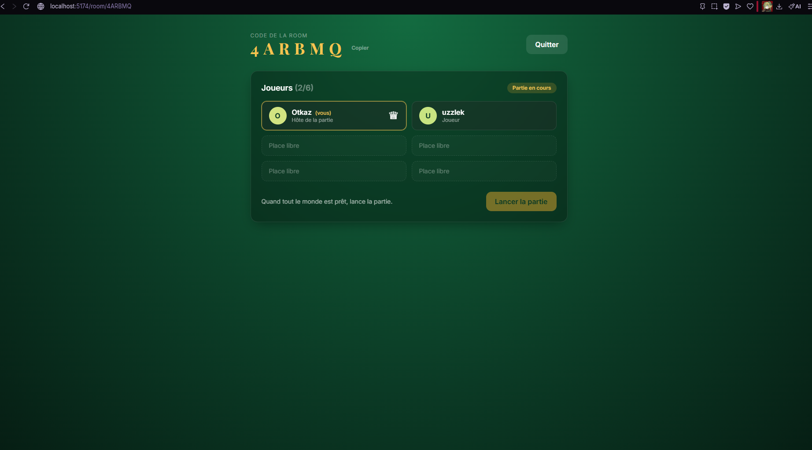

# Casino — multiplayer with friends (no real money)

**Language · Langue · 言語:** [English](#english) · [Français](#français) · [日本語](#日本語)

### Screenshot · Capture d'écran · スクリーンショット

<p align="center">
  
</p>

<p align="center">
  <strong>EN</strong> — Development preview: lobby, create/join flow, and live player list in a private room.<br />
  <strong>FR</strong> — Aperçu en développement : hall d’entrée, création ou rejoindre une room, liste des joueurs en temps réel.<br />
  <strong>JA</strong> — 開発中の画面：ロビー、ルーム作成・コード参加、リアルタイムの参加者一覧。
</p>

---

## English

Multiplayer casino-style games (Blackjack, Poker, Roulette) with **play money**,
private rooms, and chat. Full-stack TypeScript portfolio project — **no real
money** involved.

> This iteration covers **only** the multiplayer **room** layer: create a room,
> share a code, join, live player list with nicknames, host starts the game.
> A future **Blackjack** engine will plug into this layer without breaking the
> current architecture.

### Stack

- **Frontend**: React 18 + Vite + TypeScript, Tailwind CSS, Zustand,
  `socket.io-client`, React Router v6, Framer Motion
- **Backend**: Node.js + Express + Socket.io
- **Shared types**: `shared/types/room.ts` consumed by both sides via path
  mapping (`@shared/*`)

Strict TypeScript everywhere (`strict`, `noUncheckedIndexedAccess`,
`noImplicitOverride`, …) and **no `any`** in application code.

### Repository layout

```
casino/
├── shared/
│   ├── package.json             # `"type": "module"` — required for Node ESM
│   └── types/
│       └── room.ts              # Socket.io contract (single source of truth)
├── server/
│   ├── src/
│   │   ├── server.ts            # Express + Socket.io bootstrap
│   │   ├── roomManager.ts       # Pure domain logic (testable)
│   │   └── handlers/
│   │       └── roomHandlers.ts  # Socket.io side effects (event handlers)
│   ├── tsconfig.json
│   ├── .env.example
│   └── package.json
└── client/
    ├── src/
    │   ├── hooks/useSocket.ts          # Singleton + connection state
    │   ├── stores/useRoomStore.ts      # Zustand: currentRoom, actions, listeners
    │   ├── components/PlayerList.tsx   # Animated list (Framer Motion)
    │   ├── pages/LobbyPage.tsx         # Create / join
    │   ├── pages/RoomPage.tsx         # Lobby + start game
    │   ├── lib/cn.ts                   # Tailwind helper (clsx + tailwind-merge)
    │   ├── App.tsx                     # Routing
    │   ├── main.tsx
    │   └── index.css                   # Tailwind + utility classes
    ├── index.html
    ├── tailwind.config.js
    ├── vite.config.ts
    ├── .env.example
    └── package.json
```

### Local development (one machine, two browser tabs)

```bash
# 1) Install dependencies (simple monorepo, two installs)
cd server && npm install
cd ../client && npm install

# 2) Environment files (defaults are fine for local dev)
cp server/.env.example server/.env
cp client/.env.example client/.env

# 3) Start the server (port 3001)
cd server && npm run dev

# 4) In another terminal, start the client (port 5173)
cd client && npm run dev
```

On Windows / PowerShell, replace `cp` with `Copy-Item` or copy the files
manually. Open [http://localhost:5173](http://localhost:5173) in **two
windows** (or two profiles) to test create vs join.

#### Environment variables

**`server/.env`**

```env
PORT=3001
# Comma-separated list. `*` wildcards supported for tunnel subdomains
# (cloudflared / ngrok URLs that change every session).
CLIENT_ORIGIN=http://localhost:5173,https://*.trycloudflare.com,https://*.ngrok-free.app,https://*.loca.lt
```

**`client/.env`**

```env
VITE_SERVER_URL=http://localhost:3001
```

The server `.env` is loaded natively by Node 20.6+ using `--env-file=.env`
(already wired in `npm run dev`). No `dotenv` dependency.

### Play with a remote friend without deploying (Cloudflare tunnel)

To let a friend join your room from their home **without** deploying anything,
expose your local server with a **Cloudflare Quick Tunnel** — free, no signup,
WebSocket-friendly.

#### Host (you)

```powershell
# Install cloudflared (Windows)
winget install Cloudflare.cloudflared

# If `cloudflared` is not found, refresh PATH in the current terminal:
$env:PATH = [System.Environment]::GetEnvironmentVariable("PATH","Machine") + ";" + [System.Environment]::GetEnvironmentVariable("PATH","User")

# Three terminals in parallel:
cd casino\server ; npm run dev
cd casino\client ; npm run dev
cloudflared tunnel --url http://localhost:3001 --no-autoupdate
```

The third terminal prints a public URL like:

```
https://example-random-name.trycloudflare.com
```

That is your server's public URL. It **changes every time** you restart
`cloudflared` (trade-off of account-less quick tunnels).

#### Guest (your friend)

Your friend clones the repo and **only runs the client** (if they ran their
own server, they would get an isolated in-memory `RoomManager`).

```bash
cd casino/client && npm install
```

In their `client/.env`:

```env
VITE_SERVER_URL=https://example-random-name.trycloudflare.com
```

(URL you sent them). Then:

```bash
npm run dev
```

They open `http://localhost:5173`, pick a nickname, click **Join with a code**,
and enter the room code you shared.

Quick tunnel limitations: no uptime SLA, extra latency (~50–150 ms typical).
For production, host the API on Render / Fly / Railway and the SPA on
Vercel / Netlify.

### Socket.io contract

Everything is typed via `ServerToClientEvents` and `ClientToServerEvents` in
`shared/types/room.ts`. State-changing client events use a **typed ack
callback** (synchronous success/error); broadcasts remain push-only.

**Client → Server** (with ack):

| Event         | Payload                      | Ack response      |
| ------------- | ---------------------------- | ----------------- |
| `room:create` | `{ username, maxPlayers? }` | `Ack<PublicRoom>` |
| `room:join`   | `{ code, username }`        | `Ack<PublicRoom>` |
| `room:leave`  | —                            | `Ack<null>`       |
| `room:start`  | —                            | `Ack<PublicRoom>` |

**Server → Client**:

| Event          | Payload      | When?                              |
| -------------- | ------------ | ---------------------------------- |
| `room:update`  | `PublicRoom` | Any room state change              |
| `room:error`   | `RoomError`  | Pushed error outside an ack        |
| `game:started` | `PublicRoom` | Host just started the match        |

Errors carry a typed `code` so the UI can branch without parsing free text.

### Handled error cases

| Situation                               | `RoomErrorCode`        |
| --------------------------------------- | ---------------------- |
| Unknown room code                       | `ROOM_NOT_FOUND`       |
| Room full (max 6)                       | `ROOM_FULL`            |
| Nickname already taken in room (CI)     | `USERNAME_TAKEN`       |
| Invalid nickname length                 | `INVALID_INPUT`        |
| Start game without being host           | `NOT_HOST`             |
| Start with fewer than 2 players         | `NOT_ENOUGH_PLAYERS`   |
| Join a match already in progress      | `ROOM_ALREADY_STARTED` |
| Room action while not in a room         | `NOT_IN_ROOM`          |

### Notable architecture choices

- **Domain decoupled from transport.** `RoomManager` knows nothing about
  Socket.io — only `Player` / room invariants and typed `RoomManagerError`.
  `roomHandlers` map domain results to Socket.io acks/events. Same pattern
  planned for `BlackjackEngine` + `blackjackHandlers`.
- **Automatic host promotion.** If the host leaves while others remain, the
  longest-tenured player becomes host. Framer Motion `layout` animates the
  crown in the UI.
- **Client-side socket singleton.** `useSocket` shares one connection per tab,
  avoiding duplicate sockets under React `StrictMode` in dev.
- **Zustand store wires listeners once.** `attachSocket` is idempotent
  (`WeakSet`) and invoked from `App.tsx` so listeners survive route changes.
- **In-memory storage** (`Map<code, Room>`). Enough for this milestone; a
  Redis-backed implementation can swap in without changing the Socket contract.

### Technical notes (gotchas we hit)

- **`shared/package.json` with `"type": "module"` is required.** Without it,
  Node walks parent folders to infer ESM vs CJS. Because `shared/` sits outside
  `server/`, Node defaulted `shared/types/room.ts` to CJS, breaking **named**
  runtime imports like `ROOM_CONSTRAINTS` from an ESM server.
- **`tsx` does not auto-load `.env`.** We pass Node's native `--env-file=.env`
  flag in the `dev` script (Node 20.6+). No `dotenv` package.
- **Multi-origin CORS with wildcards** (e.g. `https://*.trycloudflare.com`).
  Implemented as a matcher that turns each comma-separated pattern into a
  `RegExp` against the `Origin` header.

### Roadmap

- **Blackjack engine**: `server/src/games/blackjack/` (`BlackjackEngine` pure +
  `blackjackHandlers.ts`). Room `status: 'playing'` plus new events
  (`game:state`, `game:action`, …) added to the shared event interfaces.
- **In-room chat**: `chat:message` scoped with `socket.to(code)`.
- **Persistence**: Redis adapter for `RoomManager` (public API unchanged).
- **Deployment**: API on Render/Fly, SPA on Vercel, optional **named**
  Cloudflare tunnel for stable dev URLs.

### License

ISC

---

## Français

Plateforme de jeux de casino multijoueur (Blackjack, Poker, Roulette) avec
jetons fictifs, rooms privées et chat. Projet portfolio fullstack TypeScript,
sans argent réel.

> Cette itération couvre **uniquement** le système de rooms multijoueur :
> création, partage par code, rejoindre, lister les joueurs en temps réel,
> lancer la partie. Le moteur de jeu (Blackjack en premier) viendra par-dessus
> sans rien casser à l'archi actuelle.

### Stack

- **Frontend** : React 18 + Vite + TypeScript, Tailwind CSS, Zustand,
  Socket.io-client, React Router v6, Framer Motion
- **Backend** : Node.js + Express + Socket.io
- **Types partagés** : `shared/types/room.ts` consommé par les deux côtés
  via path mapping (`@shared/*`)

TypeScript strict partout (`strict`, `noUncheckedIndexedAccess`,
`noImplicitOverride`, …) et **zéro `any`** dans le code applicatif.

### Structure du dépôt

```
casino/
├── shared/
│   ├── package.json             # `"type": "module"` — indispensable côté Node
│   └── types/
│       └── room.ts              # Contrat Socket.io (source de vérité)
├── server/
│   ├── src/
│   │   ├── server.ts            # Bootstrap Express + Socket.io
│   │   ├── roomManager.ts       # Logique de domaine pure (testable)
│   │   └── handlers/
│   │       └── roomHandlers.ts  # Effets de bord Socket.io (handlers events)
│   ├── tsconfig.json
│   ├── .env.example
│   └── package.json
└── client/
    ├── src/
    │   ├── hooks/useSocket.ts          # Singleton + état de connexion
    │   ├── stores/useRoomStore.ts      # Zustand : currentRoom, actions, listeners
    │   ├── components/PlayerList.tsx   # Liste animée Framer Motion
    │   ├── pages/LobbyPage.tsx         # Créer / rejoindre
    │   ├── pages/RoomPage.tsx          # Salle d'attente + lancer la partie
    │   ├── lib/cn.ts                   # Helper Tailwind (clsx + tailwind-merge)
    │   ├── App.tsx                     # Routing
    │   ├── main.tsx
    │   └── index.css                   # Tailwind + composants utilitaires
    ├── index.html
    ├── tailwind.config.js
    ├── vite.config.ts
    ├── .env.example
    └── package.json
```

### Démarrage en local (un seul PC, deux onglets)

```bash
# 1) Installer les dépendances (monorepo simple, deux installs)
cd server && npm install
cd ../client && npm install

# 2) Configurer les variables d'env (les défauts conviennent en local)
cp server/.env.example server/.env
cp client/.env.example client/.env

# 3) Lancer le serveur (port 3001)
cd server && npm run dev

# 4) Dans un autre terminal, lancer le client (port 5173)
cd client && npm run dev
```

Sur Windows / PowerShell, remplace `cp` par `Copy-Item` ou copie les fichiers
manuellement. Ouvre [http://localhost:5173](http://localhost:5173) dans
**deux fenêtres** (ou deux profils) de navigateur pour tester création et
rejoindre.

#### Variables d'environnement

**`server/.env`**

```env
PORT=3001
# Liste séparée par virgules. Wildcard `*` supporté pour les sous-domaines
# de tunnel (URLs cloudflared / ngrok qui changent à chaque session).
CLIENT_ORIGIN=http://localhost:5173,https://*.trycloudflare.com,https://*.ngrok-free.app,https://*.loca.lt
```

**`client/.env`**

```env
VITE_SERVER_URL=http://localhost:3001
```

Le `.env` du serveur est lu nativement par Node 20.6+ via le flag
`--env-file=.env` (déjà présent dans le script `npm run dev`). Aucune
dépendance type `dotenv` n'est nécessaire.

### Jouer entre amis sans déployer (tunnel Cloudflare)

Pour qu'un ami chez lui rejoigne ta room sans qu'on déploie quoi que ce soit,
on expose le serveur local via un tunnel **Cloudflare Quick Tunnel** —
gratuit, zéro inscription, supporte les WebSockets.

#### Côté hôte (toi)

```powershell
# Installer cloudflared (Windows)
winget install Cloudflare.cloudflared

# Si `cloudflared` n'est pas reconnu, rafraîchis le PATH dans ce terminal :
$env:PATH = [System.Environment]::GetEnvironmentVariable("PATH","Machine") + ";" + [System.Environment]::GetEnvironmentVariable("PATH","User")

# Trois terminaux ouverts en parallèle :
cd casino\server ; npm run dev
cd casino\client ; npm run dev
cloudflared tunnel --url http://localhost:3001 --no-autoupdate
```

Le 3e terminal affichera une URL du genre :

```
https://existing-digital-fine-kinda.trycloudflare.com
```

C'est l'URL publique de ton serveur. Elle **change à chaque relance** de
`cloudflared` (c'est le compromis du quick tunnel sans compte).

#### Côté invité (ton ami)

Ton ami clone le projet et **ne lance que le client** (s'il lançait son
propre serveur, il aurait son propre `RoomManager` isolé).

```bash
cd casino/client && npm install
```

Dans son `client/.env` :

```env
VITE_SERVER_URL=https://existing-digital-fine-kinda.trycloudflare.com
```

(URL que tu lui as transmise). Puis :

```bash
npm run dev
```

Il ouvre `http://localhost:5173` chez lui, choisit un pseudo, clique
« Rejoindre avec un code » et entre le code que tu lui as partagé.

Limites du quick tunnel : pas de garantie de uptime, latence ~50–150 ms
en plus, l'URL change à chaque relance. Pour un déploiement stable, on
passe sur Render/Fly/Railway côté serveur et Vercel/Netlify côté client.

### Contrat Socket.io

Tout est typé via `ServerToClientEvents` et `ClientToServerEvents` dans
`shared/types/room.ts`. Les events qui modifient l'état utilisent un
**ack callback typé** (réponse synchrone succès/erreur) ; les broadcasts
restent purement push.

**Client → Serveur** (avec ack) :

| Event           | Payload                          | Réponse (ack)      |
| --------------- | -------------------------------- | ------------------ |
| `room:create`   | `{ username, maxPlayers? }`      | `Ack<PublicRoom>`  |
| `room:join`     | `{ code, username }`             | `Ack<PublicRoom>`  |
| `room:leave`    | —                                | `Ack<null>`        |
| `room:start`    | —                                | `Ack<PublicRoom>`  |

**Serveur → Client** :

| Event           | Payload         | Quand ?                                |
| --------------- | --------------- | -------------------------------------- |
| `room:update`   | `PublicRoom`    | À chaque changement d'état d'une room  |
| `room:error`    | `RoomError`     | Erreur poussée hors d'un ack           |
| `game:started`  | `PublicRoom`    | L'hôte vient de lancer la partie       |

Les erreurs sont identifiées par un `code` typé — l'UI peut réagir
spécifiquement sans parser le `message`.

### Cas d'erreur gérés

| Cas                                                  | `RoomErrorCode`             |
| ---------------------------------------------------- | --------------------------- |
| Code de room inconnu                                 | `ROOM_NOT_FOUND`            |
| Room pleine (max 6)                                  | `ROOM_FULL`                 |
| Pseudo déjà pris dans la room (insensible à la casse)| `USERNAME_TAKEN`            |
| Pseudo invalide (longueur)                           | `INVALID_INPUT`             |
| Lancer la partie sans être hôte                      | `NOT_HOST`                  |
| Lancer la partie avec moins de 2 joueurs             | `NOT_ENOUGH_PLAYERS`        |
| Rejoindre une partie déjà commencée                  | `ROOM_ALREADY_STARTED`      |
| Action room sans être dans une room                  | `NOT_IN_ROOM`               |

### Choix d'architecture notables

- **Domaine isolé du transport.** Le `RoomManager` ne connaît rien de
  Socket.io — il manipule uniquement des `Player` / `Room` et lève des
  `RoomManagerError` typées. Les `roomHandlers` font la traduction
  domaine → ack/event Socket.io. Quand on ajoutera `BlackjackEngine`,
  même découpage : moteur pur + handlers.
- **Promotion d'hôte automatique.** Si l'hôte quitte alors que la room
  n'est pas vide, le plus ancien joueur restant est promu. Côté client,
  Framer Motion `layout` anime le déplacement de la couronne.
- **Singleton Socket côté client.** `useSocket` partage la même
  connexion à l'échelle de l'onglet. Évite les doubles connexions
  causées par `StrictMode` en dev.
- **Store Zustand auto-câblé.** `attachSocket` est idempotent
  (`WeakSet`) et appelé une seule fois dans `App.tsx`. Les listeners
  ne sont jamais démontés au gré des re-render.
- **Stockage in-memory** (`Map<code, Room>`). Suffisant pour ce ticket ;
  remplacement par Redis prévu sans toucher au contrat Socket.io.

### Notes techniques (gotchas rencontrés)

- **`shared/package.json` avec `"type": "module"` est obligatoire.**
  Sans lui, Node remonte les dossiers parents pour déterminer le format
  ESM/CJS. Comme `shared/` est en dehors de `server/`, Node retombe en
  CJS par défaut, ce qui casse les exports nommés (`ROOM_CONSTRAINTS`)
  importés depuis le serveur ESM.
- **`tsx` ne charge pas `.env` automatiquement.** On utilise le flag
  natif Node `--env-file=.env` (Node 20.6+) directement dans le script
  `dev`. Pas besoin de `dotenv`.
- **CORS multi-origines avec wildcard** (`https://*.trycloudflare.com`).
  Implémenté via une fonction matcher qui transforme chaque pattern en
  `RegExp` et accepte une liste séparée par virgules dans
  `CLIENT_ORIGIN`.

### Évolutions prévues

- **Moteur Blackjack** : `server/src/games/blackjack/`
  (`BlackjackEngine` pur + `blackjackHandlers.ts`). La room passera en
  `status: 'playing'` et exposera de nouveaux events
  (`game:state`, `game:action`, …) à ajouter dans
  `ServerToClientEvents` / `ClientToServerEvents`.
- **Chat intégré** : event `chat:message` scoped à la room.
- **Persistance** : adaptateur Redis pour `RoomManager` (l'API publique
  ne change pas).
- **Déploiement** : Render/Fly côté serveur, Vercel côté client, et
  un *named tunnel* Cloudflare avec URL stable pour le développement.

### Licence

ISC

---

## 日本語

友人同士で遊ぶマルチプレイヤー向けのカジノ風ゲーム（ブラックジャック、ポーカー、ルーレット）です。**遊び用のチップ**、プライベートルーム、チャットを想定した、TypeScript フルスタックのポートフォリオ用リポジトリで、**実金は一切扱いません**。

> 現段階では **マルチプレイヤーのルーム機能のみ** を実装しています：ルーム作成、コード共有、参加、ニックネーム付きのリアルタイム参加者一覧、ホストによるゲーム開始。今後 **ブラックジャック** などのゲームエンジンを、このアーキテクチャの上に載せても壊れないように設計しています。

### スタック

- **フロントエンド**: React 18 + Vite + TypeScript、Tailwind CSS、Zustand、
  `socket.io-client`、React Router v6、Framer Motion
- **バックエンド**: Node.js + Express + Socket.io
- **共有型**: `shared/types/room.ts` を `@shared/*` のパスマッピングで
  クライアント・サーバー双方から参照

`strict`、`noUncheckedIndexedAccess`、`noImplicitOverride` など **厳格な
TypeScript** を有効にし、アプリコードでは **`any` を使いません**。

### リポジトリ構成

```
casino/
├── shared/
│   ├── package.json             # `"type": "module"` — Node の ESM に必須
│   └── types/
│       └── room.ts              # Socket.io の契約（単一の正本）
├── server/
│   ├── src/
│   │   ├── server.ts            # Express + Socket.io の起動
│   │   ├── roomManager.ts       # 純粋なドメインロジック（テストしやすい）
│   │   └── handlers/
│   │       └── roomHandlers.ts  # Socket.io の副作用（イベントハンドラ）
│   ├── tsconfig.json
│   ├── .env.example
│   └── package.json
└── client/
    ├── src/
    │   ├── hooks/useSocket.ts          # シングルトン + 接続状態
    │   ├── stores/useRoomStore.ts      # Zustand: currentRoom、アクション、リスナー
    │   ├── components/PlayerList.tsx   # Framer Motion でのアニメーション付き一覧
    │   ├── pages/LobbyPage.tsx         # 作成 / 参加
    │   ├── pages/RoomPage.tsx          # ロビー + ゲーム開始
    │   ├── lib/cn.ts                   # Tailwind 用ヘルパー（clsx + tailwind-merge）
    │   ├── App.tsx                     # ルーティング
    │   ├── main.tsx
    │   └── index.css                   # Tailwind + ユーティリティクラス
    ├── index.html
    ├── tailwind.config.js
    ├── vite.config.ts
    ├── .env.example
    └── package.json
```

### ローカル開発（1台のPC、ブラウザ2つ）

```bash
# 1) 依存関係のインストール（シンプルなモノレポ、2回）
cd server && npm install
cd ../client && npm install

# 2) 環境変数ファイル（ローカルならデフォルトで十分）
cp server/.env.example server/.env
cp client/.env.example client/.env

# 3) サーバー起動（ポート 3001）
cd server && npm run dev

# 4) 別ターミナルでクライアント起動（ポート 5173）
cd client && npm run dev
```

Windows / PowerShell では `cp` の代わりに `Copy-Item` を使うか、手動で
コピーしてください。[http://localhost:5173](http://localhost:5173) を
**2つのウィンドウ**（または2つのプロファイル）で開き、作成側と参加側を
試せます。

#### 環境変数

**`server/.env`**

```env
PORT=3001
# カンマ区切り。トンネル用サブドメインのワイルドカード `*` に対応
# （cloudflared / ngrok はセッションごとに URL が変わることがある）。
CLIENT_ORIGIN=http://localhost:5173,https://*.trycloudflare.com,https://*.ngrok-free.app,https://*.loca.lt
```

**`client/.env`**

```env
VITE_SERVER_URL=http://localhost:3001
```

サーバーの `.env` は Node 20.6 以降の **`--env-file=.env`** で読み込みます
（`npm run dev` に既に組み込み）。`dotenv` パッケージは不要です。

### デプロイせずに遠隔の友人と遊ぶ（Cloudflare トンネル）

友人の自宅からルームに参加させたいが、まだ本番デプロイしたくない場合は、
ローカルサーバーを **Cloudflare Quick Tunnel** で公開します。無料、
アカウント不要、WebSocket にも対応します。

#### ホスト側（あなた）

```powershell
# cloudflared のインストール（Windows）
winget install Cloudflare.cloudflared

# `cloudflared` が見つからない場合は、このターミナルで PATH を更新：
$env:PATH = [System.Environment]::GetEnvironmentVariable("PATH","Machine") + ";" + [System.Environment]::GetEnvironmentVariable("PATH","User")

# 3つのターミナルを並行して起動：
cd casino\server ; npm run dev
cd casino\client ; npm run dev
cloudflared tunnel --url http://localhost:3001 --no-autoupdate
```

3つ目のターミナルに、次のような公開 URL が表示されます：

```
https://example-random-name.trycloudflare.com
```

これがサーバーの公開 URL です。**`cloudflared` を再起動するたびに URL は
変わります**（アカウントなしのクイックトンネルの制約です）。

#### ゲスト側（友人）

友人はリポジトリをクローンし、**クライアントだけ**を起動します（自分で
サーバーを立てると、メモリ上の `RoomManager` が別インスタンスになり、
あなたのルームには届きません）。

```bash
cd casino/client && npm install
```

友人の `client/.env`：

```env
VITE_SERVER_URL=https://example-random-name.trycloudflare.com
```

（あなたが送った URL）。その後：

```bash
npm run dev
```

友人は `http://localhost:5173` を開き、ニックネームを入力し、
**「コードで参加」** から、あなたが共有したルームコードを入力します。

クイックトンネルの制限：稼働保証なし、往復遅延が **およそ 50〜150 ms**
増えることがあります。本番向けには API を Render / Fly / Railway、
SPA を Vercel / Netlify などに載せる想定です。

### Socket.io の契約

`shared/types/room.ts` の `ServerToClientEvents` と `ClientToServerEvents`
で **すべて型付け**しています。状態を変えるクライアントイベントは
**型付き ack コールバック**（成功/失敗を同期的に返す）を使い、
ブロードキャストはプッシュのみです。

**クライアント → サーバー**（ack 付き）：

| イベント        | ペイロード                    | ack の戻り値      |
| --------------- | ----------------------------- | ----------------- |
| `room:create`   | `{ username, maxPlayers? }`   | `Ack<PublicRoom>` |
| `room:join`     | `{ code, username }`          | `Ack<PublicRoom>` |
| `room:leave`    | —                             | `Ack<null>`       |
| `room:start`    | —                             | `Ack<PublicRoom>` |

**サーバー → クライアント**：

| イベント        | ペイロード    | タイミング                 |
| --------------- | ------------- | -------------------------- |
| `room:update`   | `PublicRoom`  | ルーム状態が変わるたび     |
| `room:error`    | `RoomError`   | ack 以外で送るエラー       |
| `game:started`  | `PublicRoom`  | ホストがゲームを開始したとき |

エラーは型付きの `code` で識別するため、UI はメッセージ文字列を解析せずに
分岐できます。

### 扱うエラー一覧

| 状況                               | `RoomErrorCode`        |
| ---------------------------------- | ---------------------- |
| 存在しないルームコード             | `ROOM_NOT_FOUND`       |
| ルーム満員（最大6人）              | `ROOM_FULL`            |
| ルーム内でニックネーム重複（大小無視） | `USERNAME_TAKEN`       |
| ニックネームの長さが不正           | `INVALID_INPUT`        |
| ホスト以外がゲーム開始             | `NOT_HOST`             |
| プレイヤーが2人未満で開始          | `NOT_ENOUGH_PLAYERS`   |
| 進行中のゲームに参加               | `ROOM_ALREADY_STARTED` |
| ルームにいないのにルーム操作       | `NOT_IN_ROOM`          |

### アーキテクチャ上のポイント

- **ドメインとトランスポートの分離。** `RoomManager` は Socket.io を知りません。
  プレイヤー/ルームの不変条件と型付き `RoomManagerError` のみ。
  `roomHandlers` がドメイン結果を ack / イベントに写像します。将来の
  `BlackjackEngine` も同じパターン（純粋エンジン + ハンドラ）です。
- **ホストの自動昇格。** ホストが退出しても他にプレイヤーがいれば、
  最も早く参加したプレイヤーが新ホストになります。クライアントでは
  Framer Motion の `layout` で王冠の移動をアニメーションします。
- **クライアント側のソケットはシングルトン。** `useSocket` はタブ単位で
  1接続を共有し、開発時の React `StrictMode` による二重接続を避けます。
- **Zustand ストアがリスナーを一度だけ配線。** `attachSocket` は
  `WeakSet` でべき等。`App.tsx` から一度だけ呼び、ルート変更後も
  リスナーが外れません。
- **インメモリ保存**（`Map<code, Room>`）。このマイルストーンには十分。
  後で Redis に差し替えても Socket の契約は変えません。

### 技術メモ（ハマりどころ）

- **`shared/package.json` の `"type": "module"` は必須。** ないと Node が
  親ディレクトリを辿って ESM/CJS を推論します。`shared/` は `server/` の
  外にあるため、デフォルトで CJS とみなされ、ESM サーバーからの
  `ROOM_CONSTRAINTS` のような **名前付きランタイム import** が壊れます。
- **`tsx` は `.env` を自動読み込みしません。** `dev` スクリプトで Node ネイティブの
  `--env-file=.env`（Node 20.6+）を渡しています。`dotenv` は不要です。
- **複数オリジンの CORS とワイルドカード**（例: `https://*.trycloudflare.com`）。
  `CLIENT_ORIGIN` のカンマ区切りパターンをそれぞれ `RegExp` にし、
  `Origin` ヘッダと照合するマッチャで実装しています。

### 今後の予定

- **ブラックジャックエンジン**: `server/src/games/blackjack/`
  （純粋な `BlackjackEngine` + `blackjackHandlers.ts`）。ルームは
  `status: 'playing'` となり、`game:state` / `game:action` などのイベントを
  共有型インターフェースに追加します。
- **ルーム内チャット**: `chat:message` を `socket.to(code)` でスコープ。
- **永続化**: `RoomManager` の Redis アダプタ（公開 API は不変）。
- **本番デプロイ**: API を Render / Fly、SPA を Vercel などへ。開発用には
  Cloudflare の **名前付きトンネル** で安定 URL も検討。

### ライセンス

ISC
